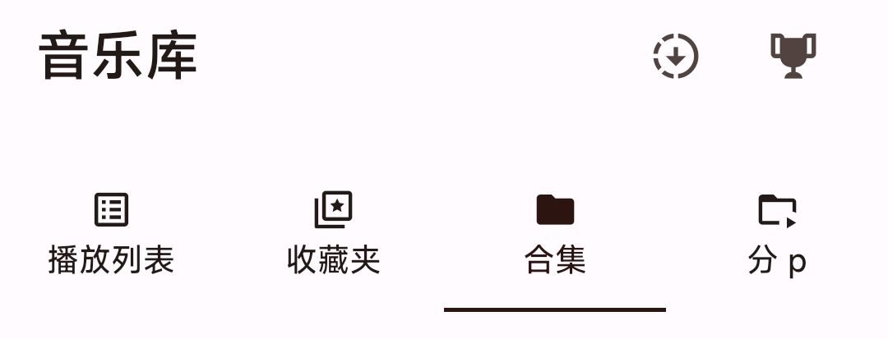

# 歌单

因为 BBPlayer 同时支持在线模式和本地优先模式，故歌单系统设计的有一点复杂，但或许值得你了解一下：

大体上看，歌单分为两大类：**在线歌单**和**本地歌单**。具体表现在「音乐库」页面中，就是这么几个图标：

「播放列表」即为本地歌单，后面三个则为在线歌单。

## 在线歌单

在**登录 bilibili 账号**的情况下，你可以直接使用 BBPlayer 播放你收藏夹、订阅合集中的内容。

### 特点

- **保持同步**：与 BiliBili 完全保持同步，收藏的内容会立刻在这里显示

- **需要网络**：废话啦！因为是直接从 API 获取的，所以得有网才能看。

- **无法编辑**：你可以随便听，但不能直接往里面加歌或者删歌。

### 同步

因为获取到的信息有限，所以在线歌单的操作十分有限，如果你愿意，可以随时把他**同步**成本地歌单。

### 「分 p」？

本质上是一个特殊的收藏夹。当你在 BiliBili 创建一个以`[mp]`开头的收藏夹时，它里面的所有视频都会被 BBPlayer 视为分 p 视频。点击后不再直接播放，而是显示视频详细信息。（同时该收藏夹也不会再在「收藏夹」页面中出现）

## 本地歌单

对于本地歌单，则又分为两种：

### 第一种：从在线歌单直接同步来的

当你在在线歌单点一下“同步”按钮创建本地歌单时，它就是这种情况。

#### 特点

- **增量更新**：你可以随时点击标题旁边的「同步」按钮增量更新歌单。

- **离线听**：只要你把歌下载下来了，就算没网也能随时播放这个列表里的音乐。

- **同样无法编辑**：因为是与在线歌单同步的，所以你不能直接往里面加歌或者删歌。但可以修改歌单名字、封面、描述以及歌曲显示名等。

#### 标记

这类歌单会显示一个「:cloud:」emoji，表示这是一个从 BiliBili 同步的歌单。

### 第二种：完全本地歌单

顾名思义，这就是传统意义上的歌单，你可以随意添加或删除任何内容。

#### 创建方式

你可以点击「播放列表」页右上角的「+」按钮创建全新的本地歌单。或是在已同步歌单中点击「复制」按钮直接在该歌单基础上创建。
